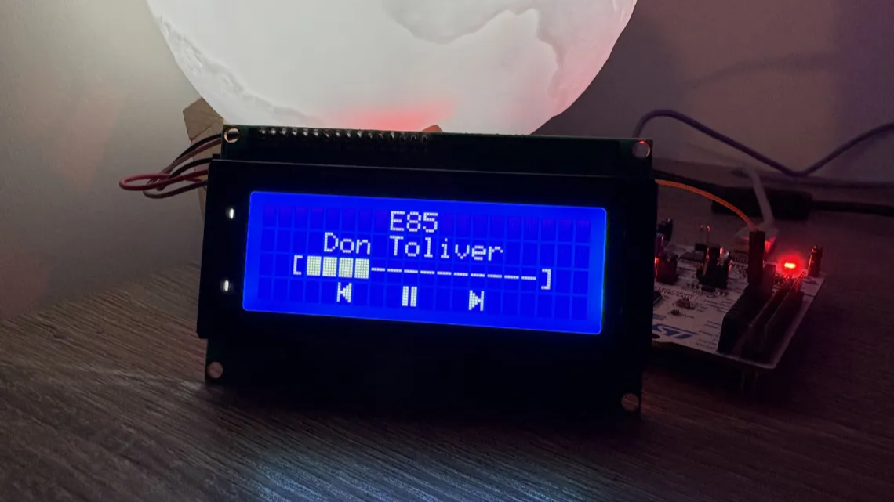

# Spotify Playback LCD Display


Real-time Spotify playback display on a 20x4 LCD.

Firmware in bare-metal C (STM32 HAL), with a Spotify data layer in Python.

## About

An STM32F401RE (Cortex-M4) drives an HD44780 LCD over I2C, showing the current track, artist, progress bar, and play/pause state. A Python bridge on the host device polls the Spotify Web API and streams playback state to the board over UART. Since it reads account state, playback on any signed-in device appears.

The firmware is interrupt-driven for I/O. Both UART reception and the scroll timer only set volatile flags in their ISRs, leaving all rendering and I2C traffic to the main loop, so incoming data is never dropped mid-frame. The display diffs new state against what's on screen and rewrites only the cells that changed, and strings too long for the 20-character line scroll at 1 Hz.

The bridge authenticates via the Spotify PKCE flow (no client secret), caching and refreshing the token on disk. Each field is converted to ASCII using `unidecode` for the HD44780 character set.

## Protocol

```text
title|artist|progress|is_playing\n
```

The serial data transfer has a 115200 baud rate, 8 data bits, no parity, and 1 stop bit. `progress` is a number from 0-100, `is_playing` is 0 or 1. The board parses with `strtok` and `atoi`, so both text fields are always sent non-empty.

## Hardware

- NUCLEO-F401RE
- 20x4 HD44780 LCD with a PCF8574 I2C adapter

<div align="center">
  <table>
    <thead>
      <tr align="center">
        <th>LCD</th>
        <th>Nucleo</th>
      </tr>
    </thead>
    <tbody>
      <tr align="center">
        <td>VCC</td>
        <td>5V</td>
      </tr>
      <tr align="center">
        <td>GND</td>
        <td>GND</td>
      </tr>
      <tr align="center">
        <td>SDA</td>
        <td>PB7</td>
      </tr>
      <tr align="center">
        <td>SCL</td>
        <td>PB6</td>
      </tr>
    </tbody>
  </table>
</div>

USART2 (PA2/PA3) is routed to the on-board ST-Link virtual COM port, so the host link runs over the same USB cable that flashes the board.

## Firmware

Open `firmware/` as an existing project in STM32CubeIDE, build, and flash over the on-board ST-Link.

**Drivers**: I2C1 (LCD, 100 kHz), USART2 (on-board ST-Link, interrupt-driven receiver), TIM11 (1 Hz scroll refresh rate). 

Pin, clock, and NVIC configuration are stored in `firmware/spotify_lcd.ioc`.

## Spotify Bridge

### Prerequisites

- Python 3.9+

```sh
cd spotify_bridge
python -m venv .venv
.venv\Scripts\activate
pip install -r requirements.txt
```

### Setup

Create an app in the [Spotify developer dashboard](https://developer.spotify.com/dashboard) and add `http://127.0.0.1:8888/callback` to its Redirect URIs.

Copy `.env.example` to `.env` and fill in the client ID and COM port number:
>To find your port name number on Windows, see *Device Manager > Ports (COM & LPT) > STMicroelectronics STLink Virtual COM Port (**COMx**)*

```text
SPOTIFY_CLIENT_ID=your_client_id
ST_LINK_UART_PORT=your_com_port
```

### Usage

```
python main.py [OPTIONS]

    -d, --debug     Enable data transfer logging
    -h, --help      Print usage help
```

The first run opens a browser for authorization and caches the token in `.spotify_token.json`.